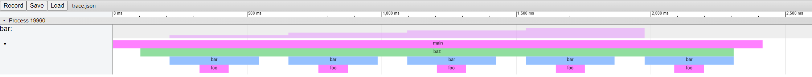

# Trace Events

Python event tracing using the [Trace Event Format](https://docs.google.com/document/d/1CvAClvFfyA5R-PhYUmn5OOQtYMH4h6I0nSsKchNAySU/edit)
which is supported by Chromium browsers and other tools

## Installing

Install and update using [pip](https://pypi.org/project/pip/)

## Usage

Add tracing to sections of your code and execute to generate a `json` trace file

```python
import time
from trace_events import Profiler, profile, timeit

@profile
def foo():
    # ... do some work

@profile(category='suspected-slow')
def bar():
    time.sleep(1)

def baz(value):
    with timeit('baz::foo'):
        foo()

    with timeit('baz::bar', value=value):
        bar()

if __name__ == '__main__':
    baz(10)

    Profiler.global_profiler().save_trace('trace.json')
```

Traces are saved `atexit` to a default `trace.json` file, or can be configured with a call to `init_trace`

```python
import trace_events

trace_events.init_trace(
    trace_file_dir='./my-traces',
    trace_file_name='my-trace.json',
    # save_at_exit = True
    # overwrite_trace_files=False,
    # logger=logging.getLogger("trace_events")
)
```

Open up a Chromium browser to [chrome://tracing](chrome://tracing) and load the file to view the trace



More examples in the examples folder

- [Basic Example](examples/basic-example.py)
- [Logging Example](examples/logging-example.py)
- [Tracing Disabled](examples/tracing-disabled.py)
